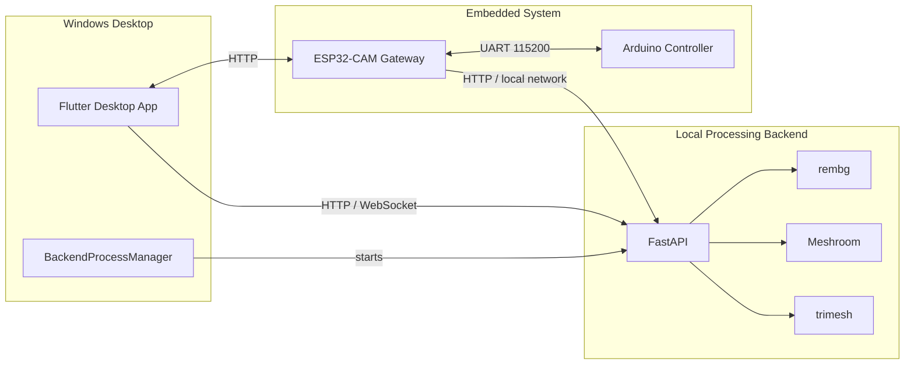

# AntaresLab

**AntaresLab** is an open-source photogrammetry and digital-twin platform that combines a Windows desktop application, a Python processing backend, and embedded IoT hardware.

The system is designed for non-invasive 3D digitization and documentation of archaeological artifacts and physical objects. It combines image capture, mechanical control, environmental telemetry, background removal, photogrammetry, and 3D model generation into a single workflow.

> **Current release:** `v4.0.0`
> **Primary target:** Windows
> **License:** Apache-2.0

---

## Overview

AntaresLab consists of three main layers:

* **Desktop application:** Flutter-based Windows application for device control, scanning, image management, telemetry, updates, and 3D results.
* **Processing backend:** FastAPI service responsible for image handling, background removal, photogrammetry orchestration, and 3D model processing.
* **Embedded system:** ESP32-CAM gateway and Arduino controller responsible for camera capture, motor control, telemetry, autonomous operation, and offline image storage.

The overall pipeline is designed to operate without relying on an external cloud service for the core scanning workflow.

---

## Architecture



---

## Components

| Component                | Path                           | Technology              | Responsibility                                                       |
| ------------------------ | ------------------------------ | ----------------------- | -------------------------------------------------------------------- |
| **Desktop Application**  | `apps/desktop/`                | Flutter / Dart          | User interface, device control, scanning, gallery, updates           |
| **Photogrammetry API**   | `services/photogrammetry-api/` | Python / FastAPI        | Image processing, rembg, Meshroom orchestration, 3D output           |
| **ESP32-CAM Gateway**    | `firmware/gateway-esp32cam/`   | Arduino / C++           | Camera capture, Wi-Fi AP, HTTP API, UART bridge, SD fallback         |
| **Arduino Controller**   | `firmware/controller-arduino/` | Arduino / C++           | Rotation, homing, telemetry, environmental control, autonomous scans |
| **Landing Website**      | `web/landing/`                 | HTML / Tailwind / GSAP  | Project and product presentation                                     |
| **Documentation Portal** | `web/docs/`                    | React / Vite / Tailwind | Technical documentation                                              |
| **Archived Components**  | `archive/`                     | Various                 | Historical implementations and prototypes                            |

---

## End-to-End Workflow

A typical scanning session follows this pipeline:

1. The Windows application connects to the local ESP32-CAM network.
2. The embedded system controls the camera and mechanical rotation.
3. The Arduino controller manages motor movement and environmental telemetry.
4. Images are captured during the scan sequence.
5. Images are transferred directly to the local PC when available.
6. When the PC is unavailable, the ESP32-CAM can use SD-card storage as a fallback.
7. The FastAPI backend receives the captured images.
8. `rembg` removes the background where required.
9. Meshroom performs photogrammetric reconstruction.
10. `trimesh` is used for post-processing and `.glb` generation.
11. The desktop application tracks processing status and loads the resulting model.

---

## Communication

### Desktop ↔ ESP32-CAM

The desktop application communicates with the ESP32-CAM over HTTP on the local device network.

Default AP address:

```text
192.168.4.1
```

### ESP32-CAM ↔ Arduino

The ESP32-CAM and Arduino communicate over UART:

```text
115200 baud
8 data bits
1 stop bit
```

The protocol uses bracketed commands for control and CSV-style telemetry messages for data exchange.

### Desktop ↔ Backend

The Flutter application communicates with the local FastAPI backend over HTTP and WebSocket.

Default backend port:

```text
8000
```

---

## Hardware

### ESP32-CAM Gateway

The ESP32-CAM acts as the gateway between the desktop application and the embedded controller.

Responsibilities include:

* Wi-Fi Access Point operation
* Camera capture
* HTTP API
* UART communication with Arduino
* SD-card image fallback
* Device status and telemetry forwarding
* Local device discovery

The firmware also uses 1-bit SDMMC configuration to preserve GPIOs required for UART communication.

### Arduino Controller

The Arduino controller is responsible for the real-time physical control layer:

* Stepper motor movement
* Homing
* Rotation sequencing
* Temperature and humidity monitoring
* Fan and heater control
* LCD status display
* Autonomous scanning
* UART command handling
* Watchdog protection

### Hardware Verification

Hardware integration was implemented and previously validated during the original development cycle.

The physical hardware is not currently available, so the `v4.0.0` release verification focused on the available Windows/software environment rather than repeating physical hardware tests.

---

## Windows Application

The primary user-facing component is the Flutter desktop application located at:

```text
apps/desktop/
```

The application provides:

* Device connection and status
* Telemetry monitoring
* Scan control
* Camera interaction
* Image/session management
* 3D model workflow
* Backend process management
* Application update handling

The Windows release automatically starts the packaged backend executable when required.

---

## Release

### v4.0.0

The current public release is:

```text
v4.0.0
```

Available release artifacts include:

* `AntaresStudio_Setup_v4.0.0.exe`
* `firmware_arduino.hex`
* `firmware_esp.bin`

The release is distributed through GitHub Releases.

[View the v4.0.0 release](https://github.com/msahhf/antareslab/releases/tag/v4.0.0)

---

## Release Verification

The `v4.0.0` Windows release was verified on:

* Windows 11
* Flutter stable
* Visual Studio with Windows desktop development tools
* Inno Setup

The verification covered:

* Flutter Windows release build
* Backend executable packaging
* Installer generation
* Installation to a clean test location
* Desktop application startup
* Automatic backend startup
* Packaged backend `/health` endpoint
* Correct application version reporting
* Release artifact generation

The physical embedded hardware was not part of this release verification because the hardware is no longer available.

---

## Getting Started

### Prerequisites

For Windows development:

* Windows 10/11
* Flutter SDK
* Dart SDK
* Python 3.10+
* Node.js 18+
* PlatformIO
* Meshroom
* Compatible ESP32-CAM hardware
* Arduino-compatible controller hardware

### Clone

```bash
git clone https://github.com/msahhf/antareslab.git
cd antareslab
```

---

## Development Setup

### Flutter Desktop

```bash
cd apps/desktop
flutter pub get
flutter run -d windows
```

Build a release:

```bash
flutter build windows --release
```

Useful checks:

```bash
flutter analyze
flutter test
```

### Python Backend

```bash
cd services/photogrammetry-api
pip install -r requirements.txt
python -m app.main
```

The packaged Windows release uses the generated backend executable instead of the development Python process.

### ESP32-CAM Firmware

```bash
cd firmware/gateway-esp32cam
pio run -e esp32cam
```

Create the local credentials file from the example template before flashing.

### Arduino Firmware

```bash
cd firmware/controller-arduino
pio run -e nanoatmega328
```

### Documentation Portal

```bash
cd web/docs
npm install
npm run dev
```

Build and lint:

```bash
npm run build
npm run lint
```

### Landing Website

The landing site is located at:

```text
web/landing/
```

It is a static web application and can be served using any compatible static server.

---

## Repository Structure

```text
antareslab/
├── .github/
├── apps/
│   └── desktop/
├── services/
│   └── photogrammetry-api/
├── firmware/
│   ├── controller-arduino/
│   └── gateway-esp32cam/
├── web/
│   ├── landing/
│   └── docs/
├── docs/
│   ├── architecture/
│   ├── api/
│   └── specs/
└── archive/
    ├── legacy-desktop-pyqt/
    ├── legacy-electronics/
    └── prototypes/
```

---

## Configuration

### ESP32 Credentials

Local Wi-Fi credentials are intentionally excluded from Git.

Create the local credentials file from:

```text
firmware/gateway-esp32cam/credentials.h.example
```

and store the real values in:

```text
firmware/gateway-esp32cam/credentials.h
```

### Backend Environment

Backend-specific configuration is stored locally in:

```text
services/photogrammetry-api/.env
```

Use the repository example as the starting point:

```text
services/photogrammetry-api/.env.example
```

Secrets and machine-specific configuration are excluded through `.gitignore`.

---

## Documentation

Technical documentation is maintained under:

```text
docs/
```

Important references include:

* `docs/architecture/overview.md`
* `docs/architecture/system-architecture.md`
* `docs/api/overview.md`
* `docs/specs/uart-protocol.md`
* `docs/specs/hardware-interface.md`

The interactive documentation portal is located at:

```text
web/docs/
```

---

## Archived Components

The repository contains several historical implementations that are no longer part of the active production architecture.

| Path                                     | Description                              |
| ---------------------------------------- | ---------------------------------------- |
| `archive/legacy-desktop-pyqt/`           | Legacy PyQt6 desktop application         |
| `archive/legacy-electronics/`            | Legacy electronics and firmware          |
| `archive/prototypes/web-colmap-backend/` | Previous COLMAP/Open3D backend prototype |
| `archive/prototypes/web-react-frontend/` | Previous React/Vite/Three.js prototype   |
| `archive/legacy-docs/`                   | Historical documentation                 |

Archived components are retained for historical reference and are not considered the current implementation.

---

## Project Status

| Component            | Status            |
| -------------------- | ----------------- |
| Flutter Desktop App  | Active — `v4.0.0` |
| FastAPI Backend      | Active            |
| ESP32-CAM Firmware   | Active — `v4.0.0` |
| Arduino Firmware     | Active — `v4.0.0` |
| Landing Website      | Available         |
| Documentation Portal | Available         |

The repository is maintained on the `main` branch.

---

## Contributing

Contributions are welcome.

Before making hardware or protocol changes, contributors should review the relevant documentation and existing implementation constraints.

See [CONTRIBUTING.md](CONTRIBUTING.md) for:

* Development workflow
* Contribution guidelines
* Commit conventions
* Hardware safety considerations

---

## Security

Security-sensitive configuration must never be committed to the repository.

See [SECURITY.md](SECURITY.md) for:

* Vulnerability reporting
* Credential handling
* Security practices
* Disclosure procedures

---

## License

AntaresLab is licensed under the **Apache License 2.0**.

See [LICENSE](LICENSE) for the full license text.

Third-party software and attribution information are documented in [NOTICE](NOTICE).

---

## Author

**Muhammedşah Fidan**

* LinkedIn: https://www.linkedin.com/in/muhammedsahfidan/
* GitHub: https://github.com/msahhf
