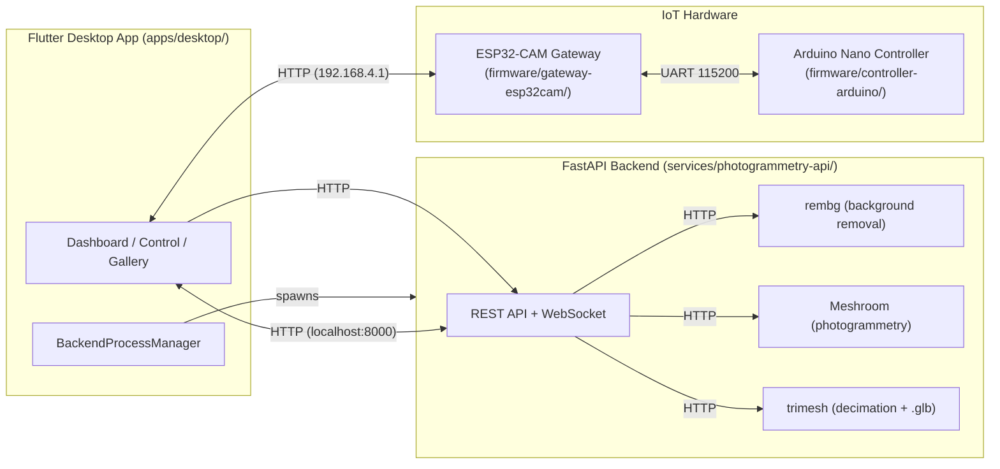

# AntaresLab

**AntaresLab** is a photogrammetry-based 3D scanning system combining a Flutter Windows desktop application, a FastAPI Python backend (Meshroom + rembg), and IoT hardware (ESP32-CAM gateway + Arduino Nano controller).

---

## Overview

AntaresLab enables autonomous 3D scanning of archaeological artifacts and objects. The system captures photo sequences via an ESP32-CAM module, processes them through a photogrammetry pipeline (background removal + Meshroom), and produces optimized 3D models (.glb). An Arduino Nano controls mechanical rotation, environmental sensors, and climate stabilization.

**Target use case:** Non-invasive digital twin generation for archaeological preservation and documentation.

---

## Architecture



---

## Components

| Component | Path | Technology | Role |
|-----------|------|------------|------|
| **Flutter Desktop App** | `apps/desktop/` | Flutter (Windows) | Primary UI — dashboard, control, gallery, OTA updates |
| **FastAPI Backend** | `services/photogrammetry-api/` | Python (FastAPI, rembg, Meshroom, trimesh) | Photogrammetry pipeline: upload → rembg → Meshroom → decimation → .glb |
| **ESP32-CAM Firmware** | `firmware/gateway-esp32cam/` | Arduino/C++ (PlatformIO) | WiFi AP gateway, camera capture, UART bridge to Arduino, SD card fallback |
| **Arduino Firmware** | `firmware/controller-arduino/` | Arduino/C++ (PlatformIO) | Motor control, homing, climate (DHT22, fans, heater), LCD, 5-min autonomous scan |
| **Landing Website** | `web/landing/` | Static HTML + Tailwind + GSAP | Product marketing site |
| **Documentation Portal** | `web/docs/` | React + Vite + Tailwind | Technical documentation (architecture, API, hardware) |

---

## Current Architecture

### Data Flow

1. **Flutter App** (Windows) connects to ESP32-CAM WiFi AP (`ANTARES_KAPSUL_LAB`, 192.168.4.1)
2. **ESP32-CAM** runs in AP mode; provides REST endpoints for capture, status, SD sync, Arduino command forwarding
3. **Arduino Nano** controls stepper motor (rotation/homing), climate (DHT22, fans, heater), LCD display
4. **Autonomous mode**: Arduino triggers capture every 5 minutes (`CEK` over UART); ESP32 routes to SD if PC unreachable, else direct
5. **Flutter-initiated scan**: Flutter orchestrates 360° rotation (8 shots × 45°), captures via ESP32, uploads to backend
6. **Backend** receives photos → rembg background removal → Meshroom photogrammetry → trimesh decimation → .glb output
7. **Flutter** polls pipeline status, downloads final .glb model for 3D viewing

### Communication Protocols

- **Flutter ↔ ESP32**: HTTP REST (192.168.4.1:80)
- **ESP32 ↔ Arduino**: UART 115200 8N1 (bracketed commands `<CMD>`, CSV telemetry `DATA,...`)
- **Flutter ↔ Backend**: HTTP REST + WebSocket (localhost:8000)
- **ESP32 ↔ Backend**: HTTP POST for IP registration (auto-discovery on 192.168.4.x subnet)

---

## Hardware

### ESP32-CAM (Gateway)

| Function | GPIO |
|----------|------|
| UART2 TX → Arduino RX | 13 |
| UART2 RX ← Arduino TX | 12 |
| Arduino RESET | 4 |
| SD_MMC D0/CLK/CMD (1-bit) | 2 / 14 / 15 |
| Camera (AI-Thinker) | Per firmware pin config |

- **Mode**: WiFi Access Point (`ANTARES_KAPSUL_LAB`)
- **Fixed AP IP**: 192.168.4.1
- **SD Card**: 1-bit SDMMC (frees GPIO 12/13 for UART2)
- **UART Bridge**: STK500 passthrough for Arduino OTA via GPIO 12/13

### Arduino Nano (Controller)

| Function | Pin |
|----------|-----|
| DHT22 (temp/humidity) | D10 |
| Soil moisture (analog) | A0 |
| SLY Fan | D11 |
| DZ Fan | D13 |
| Heater (PWM) | D5 |
| Stepper STEP | D9 |
| Stepper DIR | D8 |
| Stepper ENA | D7 |
| Home switch | D6 |

- **MCU**: ATmega328P (16 MHz)
- **UART**: 115200 8N1 (hardware Serial)
- **Watchdog**: 4s (WDTO_4S)
- **Motor**: 4.55 steps/degree, 8 shots × 45° per scan

---

## Getting Started

### Prerequisites

- Windows 10/11 (Flutter desktop target)
- Flutter SDK 3.22+ (stable)
- Python 3.10+ (backend)
- PlatformIO (firmware builds)
- Node.js 18+ (documentation portal)
- Hardware: ESP32-CAM (AI-Thinker), Arduino Nano, stepper driver, DHT22, fans, heater, LCD I2C

### Development Setup

```bash
# Clone
git clone https://github.com/ScRien/antareslab.git
cd antareslab

# --- Flutter Desktop App ---
cd apps/desktop
flutter pub get
flutter run -d windows

# --- Python Backend ---
cd services/photogrammetry-api
pip install -r requirements.txt
python -m app.main          # runs on http://localhost:8000

# --- ESP32 Firmware ---
cd firmware/gateway-esp32cam
# Copy credentials.h.example to credentials.h and edit
pio run -e esp32cam

# --- Arduino Firmware ---
cd firmware/controller-arduino
pio run -e nanoatmega328

# --- Documentation Portal ---
cd web/docs
npm install
npm run dev
```

### Hardware Connection

1. Flash ESP32 firmware (PlatformIO `esp32cam` target)
2. Flash Arduino firmware (PlatformIO `nanoatmega328` target)
3. Wire UART: ESP32 GPIO13 → Arduino RX, ESP32 GPIO12 → Arduino TX, ESP32 GPIO4 → Arduino RESET, common GND
4. Power both boards; connect PC to ESP32 WiFi AP `ANTARES_KAPSUL_LAB`
5. Launch Flutter app — it auto-starts backend and connects to ESP32

---

## Development

### Flutter App (`apps/desktop/`)

```bash
cd apps/desktop
flutter pub get
flutter run -d windows          # Development
flutter build windows --release # Release build
flutter analyze                 # Static analysis
flutter test                    # Unit/widget tests
```

**Key files:**
- `lib/main.dart` — App entry, providers, navigation
- `lib/services/backend_process_manager.dart` — Auto-starts Python backend on Windows
- `lib/services/esp32_service.dart` — ESP32 HTTP client
- `lib/providers/device_provider.dart` — ESP32 connection, telemetry, camera stream
- `lib/providers/scan_provider.dart` — Scan orchestration, SD sync

### Backend (`services/photogrammetry-api/`)

```bash
cd services/photogrammetry-api
pip install -r requirements.txt
python -m app.main          # Development (uvicorn reload)
# or: python run_backend.py # PyInstaller entry point
```

**Key files:**
- `app/main.py` — FastAPI app, lifespan, ESP32 auto-discovery, telemetry/logs endpoints
- `app/config.py` — Settings (paths, rembg, Meshroom, limits)
- `app/routers/photos.py` — Upload, rembg cleaning, status
- `app/routers/pipeline.py` — Meshroom pipeline, model download, cleanup
- `app/services/rembg_service.py` — Batch background removal
- `app/services/meshroom_service.py` — Meshroom CLI orchestration

### Firmware (`firmware/`)

```bash
# ESP32-CAM
cd firmware/gateway-esp32cam
cp credentials.h.example credentials.h  # Edit SSID/password
pio run -e esp32cam

# Arduino Nano
cd firmware/controller-arduino
pio run -e nanoatmega328
```

**Key files:**
- `firmware_esp.ino` — ESP32 main: AP mode, HTTP server, UART bridge, SD routing
- `firmware_arduino.ino` — Arduino main: motor, climate, LCD, autonomous scan, UART parser

### Documentation Portal (`web/docs/`)

```bash
cd web/docs
npm install
npm run dev      # Development server
npm run build    # Production build
npm run lint     # ESLint
```

---

## Configuration

### ESP32 Credentials (`firmware/gateway-esp32cam/credentials.h`)

```cpp
// Copy credentials.h.example to credentials.h
#define AP_SSID_CONFIG       "ANTARES_STUDIO_IOT"
#define AP_PASSWORD_CONFIG   "CHANGE_THIS_PASSWORD"  // Min 8 chars for WPA2
```

### Backend Environment (`services/photogrammetry-api/.env`)

```bash
# Copy .env.example to .env
DEBUG=True
HOST=0.0.0.0
PORT=8000
REMBG_MODEL=u2net
MESHROOM_BIN=/path/to/meshroom_batch  # Optional, auto-detected if in PATH
```

### Firmware Build Profiles

- **ESP32**: PlatformIO `esp32cam` target
- **Arduino**: PlatformIO `nanoatmega328` target

---

## Documentation

Technical documentation is available in the **Documentation Portal**:

- **Portal**: `web/docs/` — React/Vite app, run `npm run dev`
- **Architecture**: `docs/architecture/overview.md`, `docs/architecture/system-architecture.md`
- **API Reference**: `docs/api/overview.md`
- **Hardware Specs**: `docs/specs/uart-protocol.md`, `docs/specs/hardware-interface.md`

---

## Legacy / Archived Components

The following are **not** current production systems and are preserved for reference only:

| Archive | Original Location | Description |
|---------|-------------------|-------------|
| `archive/legacy-desktop-pyqt/` | `AntaresStudio/archive/` | Legacy PyQt6 desktop application |
| `archive/legacy-electronics/` | `AntaresElectronics/` | Legacy Arduino/ESP32 firmware |
| `archive/prototypes/web-colmap-backend/` | `AntaresStudio/backend/` | Old COLMAP/Open3D backend prototype |
| `archive/prototypes/web-react-frontend/` | `AntaresStudio/frontend/` | Old React/Vite/Three.js frontend prototype |

---

## Project Status

| Component | Status |
|-----------|--------|
| Flutter Desktop App | Active development (v4.0.0) |
| FastAPI Backend | Active development (v2.1 pipeline) |
| ESP32-CAM Firmware | Active (v4.0.0 hybrid routing) |
| Arduino Firmware | Active (v4.0.0 hybrid priority) |
| Landing Website | Static (v8) |
| Documentation Portal | Incomplete — cleanup in progress |

**Phase 4**: Documentation & Open Source Preparation (current)

---

## Contributing

See [CONTRIBUTING.md](CONTRIBUTING.md) for development guidelines, branching strategy, commit conventions, and hardware contribution safety requirements.

---

## Security

See [SECURITY.md](SECURITY.md) for vulnerability reporting, credential management, and security policies.

---

## License

License selection is pending. See [LICENSE AUDIT](docs/specs/license-audit.md) for evaluation of MIT / Apache-2.0 / GPL-family options. No license file has been committed yet.