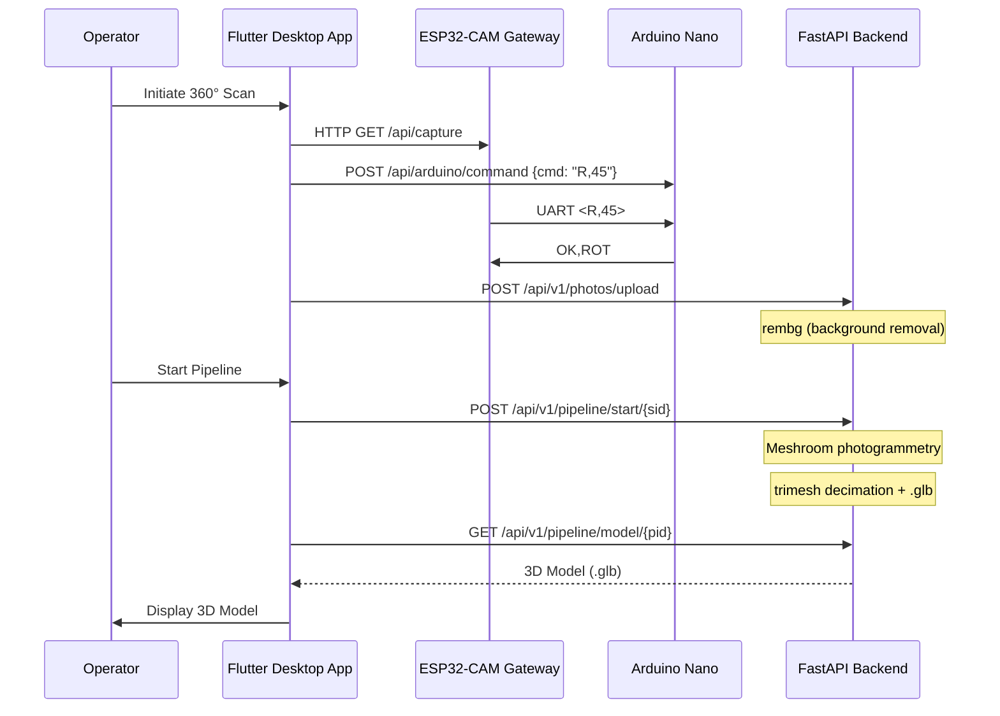

# Architecture Overview

## System Summary

AntaresLab is a photogrammetry-based 3D scanning system composed of four primary components:

1. **Flutter Desktop Application** — Windows UI for scan orchestration, gallery, and OTA updates
2. **FastAPI Backend** — Photogrammetry pipeline (rembg + Meshroom + trimesh)
3. **ESP32-CAM Gateway** — WiFi AP, camera capture, UART bridge, SD card fallback
4. **Arduino Nano Controller** — Motor control, climate, autonomous operation

---

## High-Level Data Flow



---

## Component Responsibilities

### Flutter Desktop App (`apps/desktop/`)

| Responsibility | Implementation |
|----------------|----------------|
| ESP32 connection management | `DeviceProvider` — polling, WebSocket, auto-reconnect |
| Camera stream | MJPEG via `/api/stream` |
| Scan orchestration | `ScanProvider` — 8-shot rotation, upload, SD sync |
| Backend lifecycle | `BackendProcessManager` — auto-starts Python on Windows |
| OTA updates | `BlackBoxProvider` — GitHub Releases, ESP32/Arduino firmware |
| 3D viewing | `Viewer3D` (react-three-fiber) — .glb display |

### FastAPI Backend (`services/photogrammetry-api/`)

| Endpoint Group | Routes | Purpose |
|----------------|--------|---------|
| Photos | `POST /upload`, `POST /clean/{sid}`, `GET /status/{sid}`, `GET /cleaned/{sid}/{file}` | Upload, rembg batch, session tracking |
| Pipeline | `POST /start/{sid}`, `GET /status/{pid}`, `GET /list`, `DELETE /cancel/{pid}`, `GET /model/{pid}`, `POST /cleanup/{sid}`, `POST /cleanup/cache/all`, `GET /disk-usage` | Meshroom orchestration, model download, cleanup |
| Telemetry | `GET /api/telemetry`, `POST /api/telemetry` | Dashboard telemetry buffer |
| Health | `GET /health`, `GET /api/esp32/status` | Service + ESP32 registration status |
| ESP32 Registration | `GET /api/esp32/status` | Auto-discovery on 192.168.4.x subnet |

**Key Services:**
- `RembgService` — Batch background removal (u2net model, lazy load, worker pool)
- `MeshroomService` — CLI orchestration, progress callback, cache management
- `BlackBoxService` — Firmware update management (GitHub Releases)

### ESP32-CAM Gateway (`firmware/gateway-esp32cam/`)

| Capability | Details |
|------------|---------|
| WiFi Mode | AP (`ANTARES_KAPSUL_LAB`), fixed IP 192.168.4.1 |
| Camera | AI-Thinker, JPEG, UXGA (configurable) |
| SD Card | 1-bit SDMMC (GPIO 2/14/15), timestamped sessions |
| UART | GPIO 12 (RX), 13 (TX), 4 (Arduino RESET) |
| REST Endpoints | `/api/status`, `/api/capture`, `/api/arduino/command`, `/api/camera/settings`, `/sync/list`, `/sync/download/*` |
| Hybrid Routing | PC reachable → direct; else SD card |
| OTA | HTTP upload for ESP32 + STK500 bridge for Arduino |

### Arduino Nano Controller (`firmware/controller-arduino/`)

| Capability | Details |
|------------|---------|
| MCU | ATmega328P, 16 MHz |
| Motor | Stepper (STEP/DIR/ENA), 4.55 steps/deg |
| Homing | Hall switch D6, max 2000 steps |
| Climate | DHT22 (D10), dual fans (D11/D13), PWM heater (D5) |
| Sensors | Soil moisture (A0), DHT22 temp/hum |
| Display | I2C LCD 20x4 (0x27) |
| Autonomous | 5-min interval (300s), `CEK` trigger, priority rejection |
| UART | 115200 8N1, `<CMD>` format, CSV telemetry |

---

## Communication Protocols

### Flutter ↔ ESP32 (HTTP REST)

| Endpoint | Method | Description |
|----------|--------|-------------|
| `/api/status` | GET | ESP32 + Arduino status |
| `/api/capture` | GET | Capture JPEG (returns image) |
| `/api/stream` | GET | MJPEG live stream |
| `/api/arduino/command` | POST | Forward `<CMD>` to Arduino |
| `/api/camera/settings` | GET/POST | Camera config (quality, framesize, stabilization) |
| `/sync/list` | GET | List SD card sessions |
| `/sync/download/*` | GET | Download SD file |

### ESP32 ↔ Arduino (UART 115200 8N1)

**Arduino → ESP32 (CSV, newline-terminated):**
```
DATA,<temp>,<hum>,<soil>,<heater>,<fanSly>,<fanDz>,<mode>
CEK
360_START
360_END
```

**ESP32 → Arduino (bracketed commands):**
```
<H>           Home
<R,angle>     Rotate to angle
<G>           Start 360° scan
<X>           Cancel
<P>           Pause autonomous
<C>           Continue autonomous
<S>           Status request
<E>           Enable motor
<D>           Disable motor
<V,speed>     Set motor speed
```

**Arduino Responses (newline-terminated):**
```
PONG
OK,ROT
OK,HOMING
OK,SCAN_START
OK,CANCEL
OK,MANUAL
OK,AUTO
BUSY
ERR,CMD
OK,CAP / ERR,CAP_FAIL / ERR,CAP
360_END
```

### Flutter ↔ Backend (HTTP REST + WebSocket)

| Endpoint | Method | Description |
|----------|--------|-------------|
| `/api/v1/photos/upload` | POST | Upload JPEG |
| `/api/v1/photos/clean/{sid}` | POST | Trigger rembg |
| `/api/v1/photos/status/{sid}` | GET | Session status |
| `/api/v1/photos/cleaned/{sid}/{file}` | GET | Download cleaned photo |
| `/api/v1/pipeline/start/{sid}` | POST | Start Meshroom pipeline |
| `/api/v1/pipeline/status/{pid}` | GET | Pipeline progress (polling) |
| `/api/v1/pipeline/list` | GET | All pipelines |
| `/api/v1/pipeline/cancel/{pid}` | DELETE | Cancel pipeline |
| `/api/v1/pipeline/model/{pid}` | GET | Download .glb model |
| `/api/v1/pipeline/cleanup/{sid}` | POST | Clean session data |
| `/api/v1/pipeline/disk-usage` | GET | Disk usage stats |

---

## Hybrid Image Routing

The ESP32 implements **fail-safe image routing**:

1. **PC reachable** (HTTP ping to `http://192.168.4.2:8000/api/ping` cached 3s):
   - Flutter polls `/api/capture` → direct JPEG response
2. **PC unreachable**:
   - Arduino sends `CEK` → ESP32 captures → saves to SD card
   - Path: `/session_{timestamp}/img_{timestamp}.jpg`
3. **SD Sync**: Flutter calls `/sync/list` → downloads → deletes from SD

---

## Autonomous Operation

**Arduino-First Priority:**

1. Arduino runs 5-minute timer (`AUTO_SCAN_INTERVAL = 300000 ms`)
2. On timeout: sends `CEK` → ESP32 captures → routes per hybrid logic
4. **PC commands rejected with `BUSY`** when `currentState != IDLE` (except `<X>` cancel)
5. Scan state machine: `TRIGGER_CAP` → `WAIT_CAP` (10s timeout) → `MOVE_NEXT` → `WAIT_START`

---

## Directory Structure (Runtime)

```
services/photogrammetry-api/
├── data/
│   ├── uploads/          # Raw uploads (session_id/photo_N.jpg)
│   ├── cleaned/          # rembg output (session_id/photo_N_clean.png)
│   ├── output/           # Meshroom output (session_id/pipeline_id/model.obj)
│   ├── models/           # Optimized .glb (session_id/pipeline_id/model.glb)
│   ├── meshroom/         # Meshroom working dir
│   └── meshroom_cache/   # Meshroom cache (GBs, auto-cleaned)
```

---

## Configuration

| Component | Config File | Key Settings |
|-----------|-------------|--------------|
| ESP32 | `credentials.h` | `AP_SSID_CONFIG`, `AP_PASSWORD_CONFIG` |
| Backend | `.env` / `config.py` | `REMBG_MODEL`, `MESHROOM_BIN_PATH`, `MAX_UPLOAD_SIZE_MB`, `AUTO_CLEANUP_CACHE` |
| Arduino | `firmware_arduino.ino` | Pin defines, `MOTOR_STEPS_PER_DEG`, `AUTO_SCAN_INTERVAL` |
| Flutter | `pubspec.yaml` | Dependencies, version |
| Docs | `vite.config.js` | Build config |

---

## Deployment Notes

- **PC must join ESP32 AP** (`ANTARES_KAPSUL_LAB`) before starting backend
- **Backend binds `0.0.0.0:8000`** — firewall must allow inbound on WiFi interface
- **Flutter auto-starts backend** on Windows via `BackendProcessManager`
- **ESP32 auto-registers backend IP** on startup (subnet discovery)
- **No cloud dependency** — fully local operation