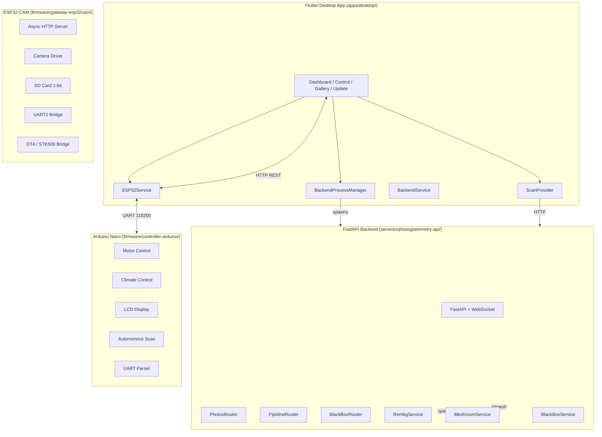

# System Architecture

## Component Diagram

---

## Data Stores

| Store | Location | Purpose |
|-------|----------|---------|
| `data/uploads/` | Backend | Raw JPEG uploads (session-scoped) |
| `data/cleaned/` | Backend | rembg output PNGs |
| `data/output/` | Backend | Meshroom OBJ/PLY outputs |
| `data/models/` | Backend | Optimized .glb models |
| `data/meshroom_cache/` | Backend | Meshroom cache (auto-cleaned) |
| SD Card | ESP32 | Timestamped session folders (fallback) |
| LCD / Serial | Arduino | Runtime status display |

---

## Process Lifecycle

### Flutter App Startup

1. `main.dart` → `WidgetsFlutterBinding.ensureInitialized()`
2. `BackendProcessManager().startBackend()` → spawns `python -m app.main` (Windows)
3. `DeviceProvider.connect()` → polls ESP32 `/api/status` (exponential backoff)
4. `ScanProvider` ready for user interaction

### Backend Startup

1. `app/main.py` → `lifespan` context manager
2. `run_discovery_and_registration()` → finds PC IP on 192.168.4.x subnet
3. Registers with ESP32 `/api/config/backend-ip`
4. Starts periodic re-registration task (60s interval)
5. Mounts static dashboard, includes routers

### ESP32 Boot

1. `setup()` → init SD (1-bit), Camera, WiFi AP
2. `startHTTPServer()` → 9 endpoints registered
3. `logSD("INFO", "Hybrid System v4.0 Active")`
4. WDT configured (10s)

### Arduino Boot

1. `setup()` → init DHT, LCD, pins, motor disabled
2. `wdt_enable(WDTO_4S)` → 4s watchdog
3. `lastCommandReceivedTime = millis()` → autonomous timer starts

---

## Concurrency Model

| Component | Model |
|-----------|-------|
| Flutter | Single-threaded (Dart isolate), async/await for I/O |
| Backend | Async (FastAPI + asyncio), BackgroundTasks for heavy ops |
| ESP32 | FreeRTOS (Arduino core), single loop + HTTP server tasks |
| Arduino | Bare metal (superloop), non-blocking motor + state machine |

**Thread Safety:**
- Backend: In-memory dicts (`sessions`, `pipelines`) — single-process, asyncio-safe
- ESP32: `esp_task_wdt_reset()` + `yield()` in SD writes
- Arduino: `wdt_reset()` in loop, non-blocking motor steps

---

## Error Handling & Recovery

| Layer | Strategy |
|-------|----------|
| Flutter | Exponential backoff reconnect (1s, 2s, 4s), `reconnecting` state |
| Backend | Graceful shutdown (lifespan), `try/catch` in background tasks, Meshroom cancel |
| ESP32 | WDT (10s), `yield()` in SD writes, HTTP 500/404 with JSON error |
| Arduino | WDT (4s), motor watchdog-fed, 10s capture timeout, `BUSY` rejection |

---

## Resource Limits

| Resource | Limit | Handling |
|----------|-------|----------|
| Photo per session | 100 | HTTP 400 |
| Upload size | 50 MB | HTTP 413 |
| Pipeline photos min | 3 | HTTP 400 |
| Meshroom cache | Auto-clean (5min delay) | Background task |
| Session TTL | 24 hours | Manual cleanup endpoint |
| UART buffer | 64 chars | Truncation |
| HTTP timeout | 5s (ESP32), 2s (Backend health) | Retry/cancel |

---

## Scalability Considerations

| Bottleneck | Current | Future |
|------------|---------|--------|
| In-memory session/pipeline state | Single process | Redis/DB |
| Meshroom CPU/GPU | Sequential | Worker pool + queue |
| SD card throughput | 1-bit mode ~1 MB/s | 4-bit mode if pins available |
| ESP32 heap | ~300 KB free | Monitor via `/api/status` |
| Arduino RAM | ~2 KB | Minimal allocations |

---

## Security Boundaries

| Boundary | Protection |
|---------|------------|
| Flutter ↔ Backend | Localhost only (Windows), CORS `*` (dev) |
| Flutter ↔ ESP32 | WiFi AP isolation, no auth (local network) |
| ESP32 ↔ Arduino | UART physical, no encryption |
| Backend ↔ Meshroom | Local subprocess, sandboxed dirs |
| OTA | Local network only, STK500 bridge requires UART access |